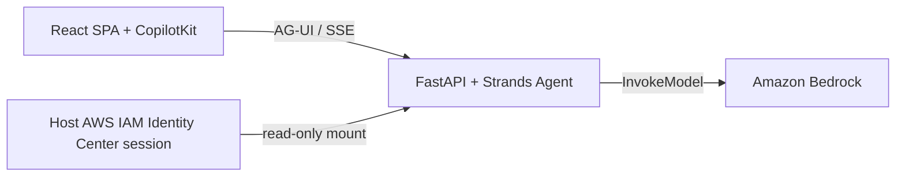

# Strands CopilotKit Sample Plan

## Goal

Build a local, two-container sample application: a React SPA with CopilotKit connects directly to a Python Strands Agent over AG-UI/SSE. The agent uses Amazon Bedrock and has a local-time tool. Docker Compose runs every component except Bedrock itself.

## Architecture

## Implementation Steps

1. Create a Vite React TypeScript SPA in `frontend/`.
2. Add CopilotKit v2 and the AG-UI `HttpAgent`; configure `selfManagedAgents` to call the backend endpoint directly.
3. Create a FastAPI app in `backend/` using `ag_ui_strands` to expose a Strands Agent via AG-UI.
4. Configure `BedrockModel` from `BEDROCK_INFERENCE_PROFILE_ID` and `AWS_REGION`, and register `get_local_time` as a deterministic tool. The value may be a cross-Region inference profile ID or an application inference profile ARN.
5. Add two local-only services to Compose, including backend health checks and SPA startup dependency.
6. Mount only the host AWS config and IAM Identity Center cache as read-only paths. Do not use static credentials or bake AWS data into images.
7. Verify frontend production builds, Compose configuration resolves, the backend health endpoint responds, and both normal conversation and the time tool work after SSO login.

## Required Configuration

The user supplies these non-secret values in `.env`:

- `AWS_PROFILE`: an existing IAM Identity Center profile.
- `AWS_REGION`: a Bedrock-enabled AWS Region.
- `BEDROCK_INFERENCE_PROFILE_ID`: an inference profile ID or ARN that the AWS account can invoke.

Before Compose starts, authenticate on the host with `aws sso login --profile <AWS_PROFILE>`.

## Scope

Included: React SPA, CopilotKit UI, AG-UI streaming, Python Strands Agent, Amazon Bedrock, local-time tool, Docker Compose, and IAM Identity Center support.

Excluded: CopilotKit Runtime as a third container, database/thread persistence, application authentication, static AWS keys, and production deployment configuration.
